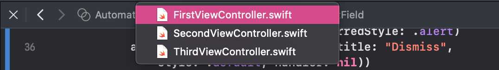
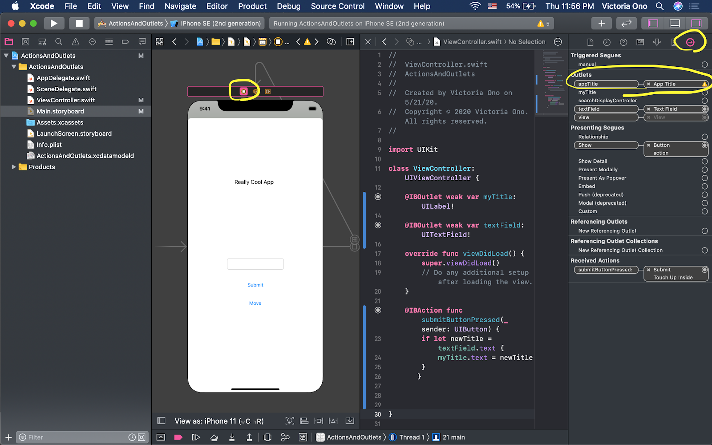
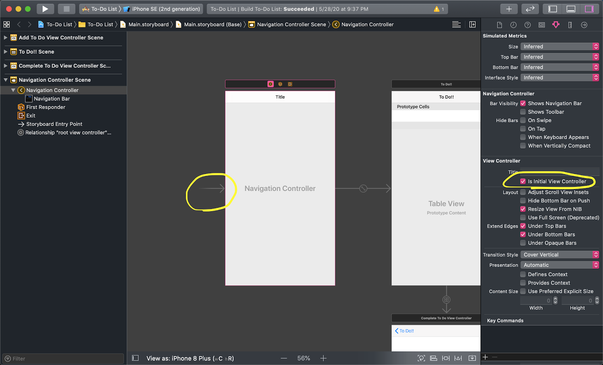

## Find tips for Swift/Xcode here!

I've compiled some common errors I noticed during [Kode with Klossy](https://kodewithklossy.com) for easy steps to fix them!
Some of them are very minor, but this is meant for beginners who have never used Xcode before :)


### Small Tips

#### 1. **Object Library doesn’t show up when clicking + button (shows Snippets instead)!**
Click anywhere on the screen of your storyboard then click the + button! The reason Xcode opens up the Snippet Library is because you’re on the code “tab.” These code snippets are actually useful if you want to save time writing out functions with multiple parameters!


#### 2. **The assistant editor I want doesn’t show on the right!**
Ugh I know, it’s so annoying. Aside from clicking  and choosing “Assistant,” while having just the storyboard open, here is another way. 

If you have multiple View Controllers, you can open the corresponding Swift file by either clicking thebutton on top of your view controller scene in the storyboard or selecting it from the drop down menu that appears when you click the .swift file name on top of the editor as shown below.



#### 3. **I want to rename my outlet/action name!**
Hold your horses. We want to be careful here and not just rename them because then it will run into an ugly error. To rename the variable/function name, highlight the name, right click, then Refactor -> Rename. Xcode will then basically do a “find and replace” business so all the property names and connections match up (this is for Xcode 9 and beyond, which I believe all of you have.) 

#### 4. **How do I find exactly where I made an error?**
I don’t always do this but there’s a good way to check where Xcode throws an exception when you don’t know what causes the app to crash!

First, open the Breakpoint navigator in the Navigation Pane on the left side of your window. Then, click the + button in the bottom-right corner. Select Exception Breakpoint, and next to ‘Exception,’ select ‘All.’ A new breakpoint should show up in the navigator!

So, if you run the app now, when the code “breaks,” it will pause at the line that threw the exception. Yay! Hopefully you can find the error more easily :)


### Errors

#### 1. **Thread 1: signal SIGABRT (or Exception: "[<’your project name’.ViewController 0x7fda3fe094e0> setValue:forUndefinedKey:]: this class is not key value coding-compliant for the key ‘variable name’."**
Oh god the most scary of all. We do not enjoy SIGABRT - it’s too generic of an error. Xcode is basically saying, “Look, your app crashed, that’s all we know.” 
It has nothing to do with the line of code where it’s highlighted (AppDelegate). It’s highlighted there because that’s the first line of code of your app when it runs.

BUT most of the time it’s caused by your outlets/actions! You connected a UI element (button/label etc) to your code, which means there is now a connection between a property of your view controller and the UI element. At one point you changed the name of the initial outlet property and your app crashed. Bummer.

What to do: Click on the Connections Inspector after clicking your view controller scene, then look for any warning signs. Either rename it to the original name you had, or remove the outlet connection and reconnect with the new name.


#### 2. **Thread 1: signal SIGTERM**
SIGTERM is like a more polite version of SIGABRT. Xcode is saying, “Hey, we had to exit your program, it seems like something went wrong.”
This error tends to happen when you try to run your app on a physical device. Maybe you ran a test on your device then quit the app from it before you hit stop in Xcode. 

What to do: 1) Click Product -> Clean Build Folder. 2) Restart Xcode (I know, not a fun choice, but it be like that sometimes).
  - Whenever you’re sure your code is perfectly fine but there’s errors once you run the Simulator, always try those two steps.

#### 3. **My Simulator only shows a black screen!**
If the console also says something about how it can’t find the SceneDelegate, this might solve the problem: make sure you’ve designated an initial view controller in your StoryBoard.


See that little arrow pointing to the Navigation Controller here? That’s what we need for every project we create. Otherwise the Simulator doesn’t know where to start showing the app! 

For all apps that would require going back and forth between pages (ex. To Do List), we need a Navigation Controller - a ‘parent’ view controller that manages these ‘child’ VCs and groups them so they can be navigated around. So, make sure that is the initial VC for your project.

#### 4. **(GitHub) Line x startTag: invalid elementname** ([source](https://cyclogramblog.wordpress.com/2015/10/31/if-you-are-getting-the-error-line-x-starttag-invalid-element-name/))
If you’re working on a group project and you tried to push, but you got this error, it means you and your group mates worked on the project at the same time and GitHub is confused as to which version to update! 

Open Main.storyboard by right-clicking on it, going down to “Open As” → “Source Code.” Then, scroll down or Command+F to find the line like this:
```markdown
<<<<<<< HEAD
 code (let's call it A)
========
 code (let's call it B)
>>>>>>>> master
```

Delete code B as well as ==== and >>>> master (you can also do Command+X in case it’s some code you want to keep for later), and try running it. Hopefully the problem is solved!
If not, undo what you did and try deleting code A instead.
Make sure you do all the Git stuff on Xcode (committing, pushing, pulling, etc.); if you do some on Xcode and some on Github, it might get confused again!

### Helpful Links

[Using Auto Layout](https://www.appcoda.com/learnswift/auto-layout-intro.html) (aka constraints) (shoutout to lovely Karen Chen for the link <3)
- I really love how they break them down into small steps! It’s super easy to follow. The next chapter (Chapter 6) on Stack Views is also really helpful! Unfortunately the subsequent chapters are not available for free :/
  
 [Xcode References](https://drive.google.com/file/d/1GbGeOfovKE7RV85VesN-76FUXnb-Cwvy/view?usp=sharing) (shoutout to Maria Herne for this amazing poster!)
 - It explains how to delete references (similar to what I noted above) and other important terms like connections and source control with pretty colors!!


### Contact
If you have any questions/suggestions, feel free to email me at: victoriaono@college.harvard.edu
